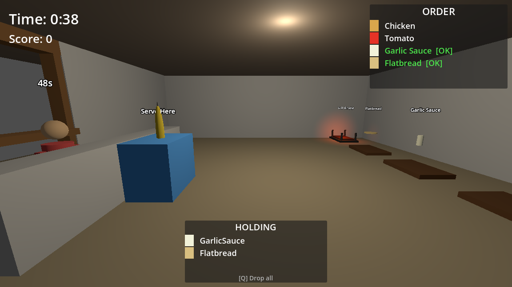
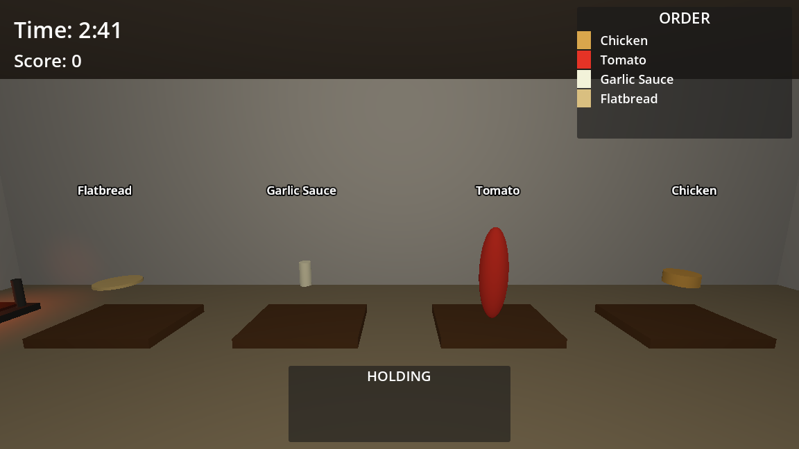
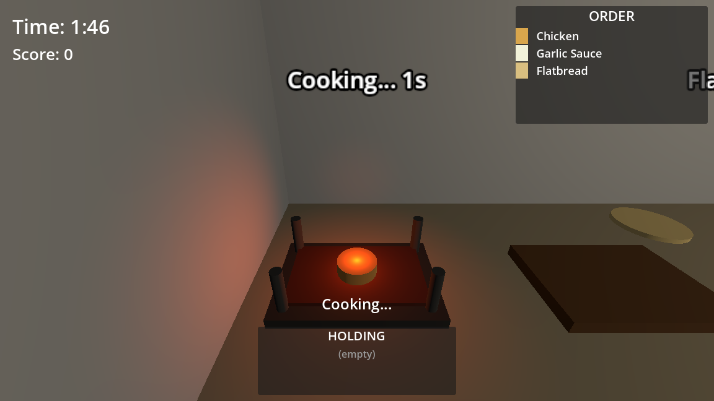
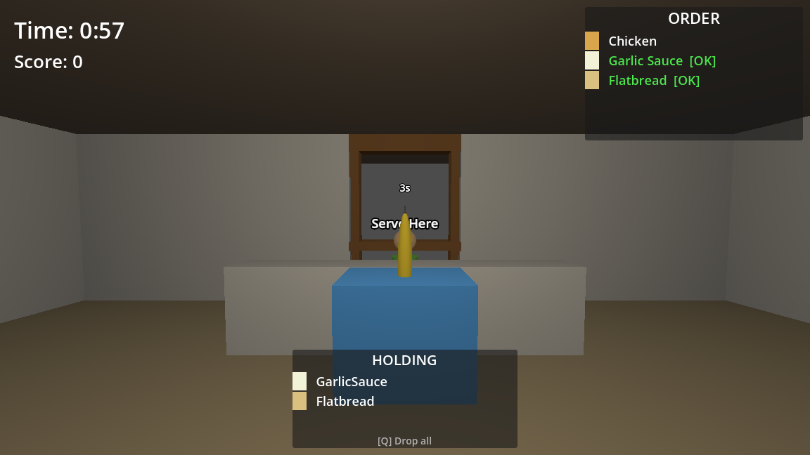

# Shawarma Shop Simulator

A 3D shawarma shop management game built with Godot 4.6 and C#. Run your own shawarma counter — take orders, gather ingredients, cook chicken on the grill, wrap shawarma, and serve customers before they lose patience!



## Gameplay

You play as a shawarma shop worker in a first-person 3D environment. Customers arrive at the counter with randomized orders, and you must:

1. **Read the order** — check the ORDER panel (top-right) to see what ingredients are needed
2. **Gather ingredients** — walk to ingredient stations along the back wall and press **E** to pick them up
3. **Cook the chicken** — raw chicken must be grilled first! Place it on the Grill Station and wait for it to cook. Pick it up before it burns!
4. **Wrap the shawarma** — bring all ingredients to the Wrap Station and press **E**
5. **Serve the customer** — deliver the finished shawarma at the Serve Counter

Score points for each successful serve. The faster you serve, the more points you earn!

### Ingredient Stations



Walk up to any station and press **E** to pick up an ingredient. Each station has a unique floating indicator:
- **Chicken** — golden disc (must be cooked on the grill before it counts)
- **Tomato** — red sphere
- **Garlic Sauce** — white bottle
- **Flatbread** — flat disc

### The Grill



The grill is a key mechanic. Orders require *cooked* chicken, not raw:

- Place raw chicken on the grill with **E**
- Watch the countdown — chicken cooks in **5 seconds**
- Pick it up when the label says **"Chicken Ready!"**
- If you wait too long (**8 more seconds**), it **burns** and becomes useless — clear the grill and start over

### Serving



The ORDER panel tracks your progress with green **[OK]** marks as you collect each ingredient. Once you've wrapped the shawarma, deliver it at the Serve Counter. A floating score popup shows your points!

### Difficulty Ramping

The game gets progressively harder as you serve more customers:

- Every **3 serves**: customer patience decreases (they leave sooner!)
- Every **2 serves**: next customer arrives faster
- After **5 serves**: orders require at least 2 toppings instead of 1

## Controls

| Key | Action |
|---|---|
| **WASD** | Move |
| **Mouse** | Look around |
| **E** | Interact (pick up, place, wrap, serve) |
| **Q** | Drop all held ingredients |

## Tech Stack

| Component | Technology |
|---|---|
| Engine | [Godot 4.6](https://godotengine.org/) (Forward Plus renderer) |
| Language | C# (.NET 10) |
| Physics | Jolt Physics |
| Graphics | D3D12 (Windows) |
| Testing | xUnit v3 |

## Project Structure

```
FirstProject.csproj         # Godot game project
scripts/                    # C# game scripts (Player, GameManager, stations, etc.)
scenes/                     # Godot scene files (.tscn)
ui/                         # HUD and end screen
src/FirstProject.ShopLogic/ # Pure C# game logic (orders, scoring, ingredients)
tests/                      # xUnit test projects
qa/                         # QA testing helpers
```

## Building & Running

### Prerequisites

- [Godot 4.6 Mono](https://godotengine.org/download/) (C# edition)
- [.NET 10 SDK](https://dotnet.microsoft.com/download)

### Build

```bash
dotnet build FirstProject.slnx
```

### Run Tests

```bash
dotnet test FirstProject.slnx
```

### Play

Open the project in Godot Editor, then press **F5** to run. The game starts in `scenes/ShopLevel.tscn`.

## Architecture

The game separates Godot-dependent code from pure business logic:

- **`scripts/`** — Godot node classes that handle rendering, physics, and input
  - `Player.cs` — first-person character controller with raycasting interaction
  - `GameManager.cs` — autoload singleton managing game state, scoring, and customer spawning
  - `GrillStation.cs` — cooking state machine (Empty → Cooking → Ready → Burnt)
  - `Customer.cs` — AI-driven customer with walk-in, waiting, and walk-out states
  - `IngredientStation.cs` — pickup stations with floating/rotating visual indicators
- **`src/FirstProject.ShopLogic/`** — pure C# logic, fully testable without Godot
  - `OrderGenerator.cs` — randomized order creation with difficulty scaling
  - `ScoreTracker.cs` — scoring with time bonuses
  - `IngredientType.cs` — ingredient enum (Chicken, CookedChicken, Tomato, etc.)
- **`ui/`** — HUD showing order, held ingredients, timer, score, and interaction prompts

## License

This is a learning project. Feel free to use it as reference for your own Godot C# games.
